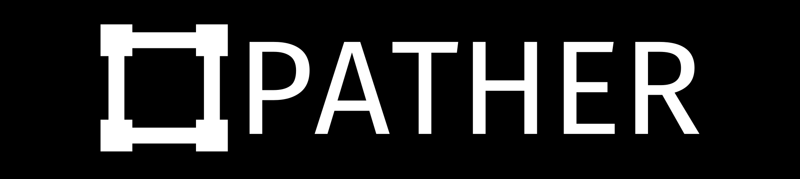
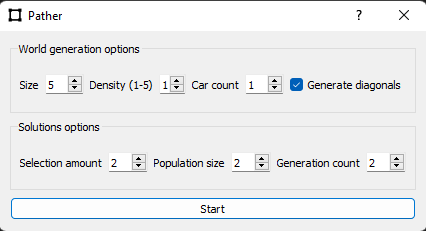

## Informations générales

---

Pather est une application qui permet de trouver une solution à un réseau de points et de voitures en trouvant la séquence la plus rapide pour que toutes les voitures arrivent à leur destination.

Afin de trouver une solution, un algorithme génétique et l'algorithme de recherche de chemin A* sont utilisés.

Le code est écrit en python et utilise la librairie ManimCE pour l'affichage des solutions.
Nous utilisons PyQt5 pour faire notre interface graphique.

## Utilisation

---

À l'aide du formulaire, vous pouvez choisir les spécifications que vous souhaitez pour créer une nouvelle simulation

## Champs du formulaire

---

### World generation options

#### Size

Le champ "Size", ou Taille, permet à l'utilisateur de modifier la quantité de points dans son réseau. La valeur ne représente pas exactement le nombre de points, mais suis plus l'échelle suivante : 

#### Density (1-5)

Le champ "Density", ou Densité du réseau, permet de modifier 2 choses, le nombre de points du réseau et le nombre de liens entre les différents points du réseau. La valeur va entre 1 et 5, 1 étant un réseau avec moins de liens et moins de points et 5 avec beaucoup de liens

#### Car count

Le champ "Car count", ou Quantité d'automobiles, permet de modifier le nombre d'auto qui vont parcourir le réseau. La relation entre la valeur entre et le nombre d'autos est 1 à 1.

#### Generate diagonals

La case à cocher "Generate diagonals", ou Générer les diagonales, permet de modifier si les points ont des liens diagonals entres eux.

### Solution options

#### Selection amount

Le champ "Selection amount", ou Montant selectionné, permet de choisir le nombre de meilleurs solutions sauvegardées entre les générations sur lesquelles les prochaines générations vont se basé pour évoluer

#### Population size

Le champ "Population size", ou Taille de la population permet de décider le nombre de solutions générées par générations

#### Generation count

Le champ "Generation count, ou Nombre de générations, permet de décider le nombre de générations que le programme va faire avant de sortir le meilleur résultat.

## Installation

---

Pour installer l'application :

- [Installer les dépendances](Docs/Dependecies.md)

## Credits

---

The Manim Community Developers. (2022). Manim – Mathematical Animation Framework (Version v0.17.2) [Computer software]. https://www.manim.community/
